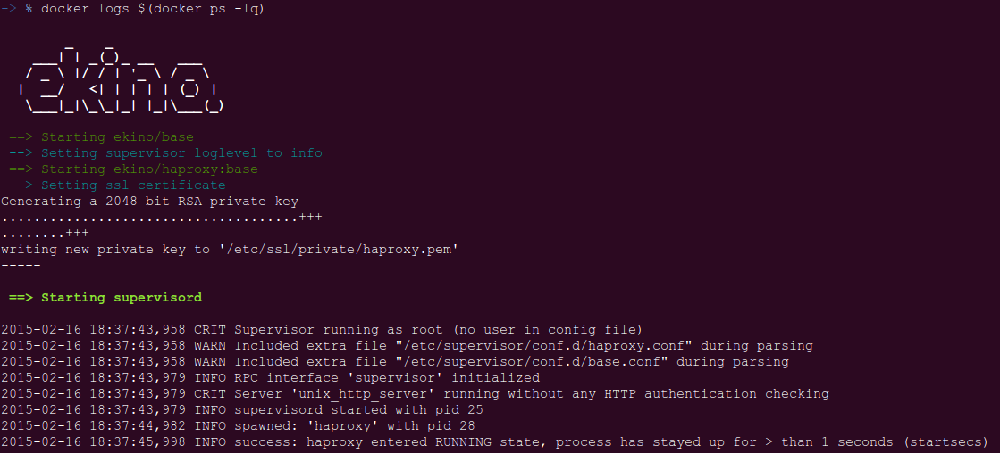

# Ekino RP/LB

[](https://circleci.com/gh/ekino/docker-rp-lb)

## Description

This repo aims to contain various *reverse proxying* and *load balancing* solutions.
It starts with this only `haproxy` image but should be extended in the future.

It's the official image sources for :
* [`ekino/haproxy`](https://registry.hub.docker.com/u/ekino/haproxy/)



## TL;DR

If you are on linux, simply execute this command :

```bash
curl -sSL https://raw.githubusercontent.com/ekino/docker-rp-lb/master/helper.sh | bash -s clear run
```

This won't be very useful as the sample configuration won't fit your requirements. See below to customize your container config.

## Usage

### Custom config

From the command line:
```bash
docker run --name reverseproxy.local -d \
  -p 443:443 \
  -v "$(readlink -f haproxy.cfg)":/etc/haproxy/haproxy.cfg \
  ekino/haproxy:base
```

*Note: When using a custom configuration file beware to remove or comment the
`daemon` option in haproxy global section*

### Custom certificates

The sample configuration is based on SSL and will create a self generated certificate to SSL to `/etc/ssl/private/haproxy.pem`

You can use a custom location for this certificate (to fit with your `haproxy.cfg` file):
```bash
docker run --name reverseproxy.local -d \
  -p 443:443 \
  -v "$(readlink -f haproxy.cfg)":/etc/haproxy/haproxy.cfg \
  -e SSL_CERT="/path/in/haproxycfg/cert.pem" \
  ekino/haproxy:base
```

Or you can use your own certificate:
```bash
docker run --name reverseproxy.local -d \
  -p 443:443 \
  -v "$(readlink -f haproxy.cfg)":/etc/haproxy/haproxy.cfg \
  -v "$(readlink -f "relative/path/on/host/cert.pem")":/path/in/haproxycfg/cert.pem \
  ekino/haproxy:base
```

### Enable HTTP

We use HTTPS by default. To enable HTTP just export port 80 and provide a
configuration file with the relevant bindings:

```bash
docker run --name reverseproxy.local -d \
  -p 80:80 \
  -v "$(readlink -f haproxy.cfg)":/etc/haproxy/haproxy.cfg \
  ekino/haproxy:base
```

### Show status

To see the backend servers statuses use this command:
```bash
docker exec -ti reverseproxy.local /showstat.sh
```

